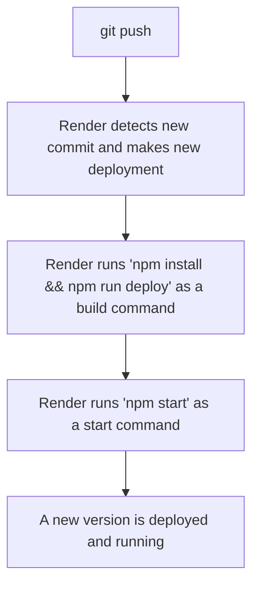

# Phonebook app

Production version running at [fs3.prökkinen.fi](https://www.fs3.prökkinen.fi)

## Workflow on deployment

```mermaid
graph TD
    A[git push]
    B[Render detects new commit and makes new deployment]
    C[Render runs 'npm install && npm run deploy' as a build command]
    D[Render runs 'npm start' as a start command]
    E[A new version is deployed and running]
    A --> B
    B --> C
    C --> D
    D --> E

```

Deploy script builds the latest frontend version.
